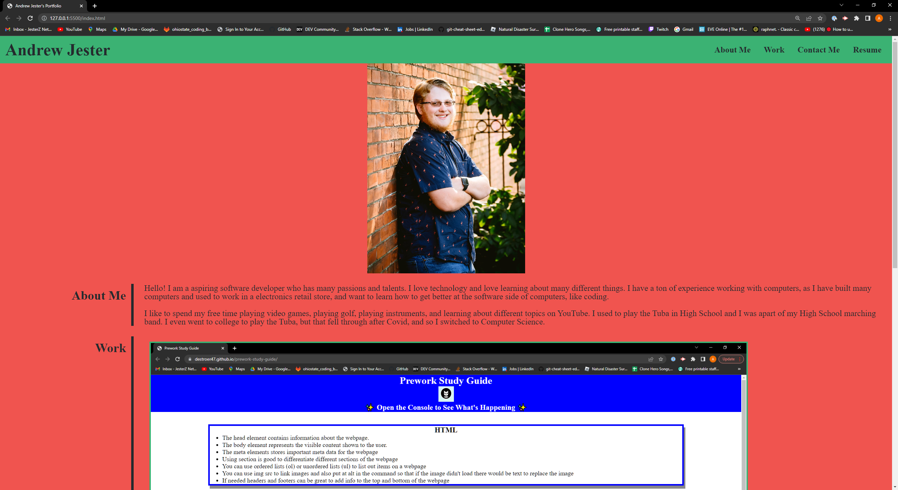

# My Portfolio #
This is a Website I created to give people a brief introduction about myself, my coding projects, and how to contact me

## Description ##
This website was created to practice semantic HTML elements and CSS, and to showcase other coding projects I have worked on. It includes links to sections of the page, a download of my Resume, a personal self portrait, a brief introduction about myself, two projects I worked on: Prework Study Guide, and HTML Semantics Challenge, and a list of ways to contact me.

## Getting Started ##
There will be a link below that you can click on that will take you to the GitHub Pages deployment of this website, and also a example photo of what the website looks like.

## Website ##

[My Portfolio Website](https://destroer47.github.io/My-Portfolio/)

